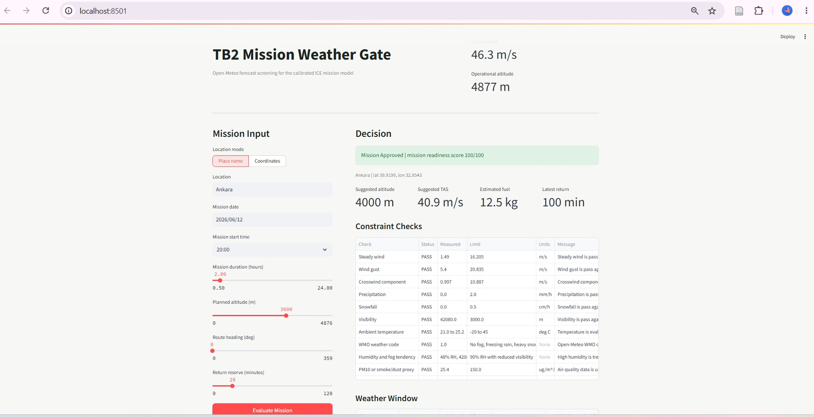

# UAV Mission Weather Gate

*Individual project · developed within my capstone thesis on the Bayraktar TB2 · Izmir University of Economics · Spring 2026*



## Engineering question
Should a TB2-class UAV mission go ahead at a given place and time, based on the forecast weather? If it does, what altitude, airspeed, fuel and return time should the planner use?

## What it does
A pre-flight mission-readiness tool built alongside my MATLAB ICE mission model ([tb2-propulsion-comparison](https://github.com/Kiwiiiieee/tb2-propulsion-comparison)).
1. The user enters a place name (or coordinates), mission date and start time, duration, planned altitude, route heading and fuel reserve.
2. The backend fetches the **Open-Meteo** hourly forecast, air-quality data and geocoding for the mission window. No API key is needed.
3. The decision engine checks every hour of the window against the TB2 operating envelope: steady wind, gusts, crosswind component, precipitation, snowfall, visibility, temperature, WMO weather code (fog, freezing rain, thunderstorms), humidity and fog tendency, PM10 and smoke/dust, and mission altitude.
4. The overall decision is the most restrictive result: **Mission Approved (GO)**, **Proceed with Caution (CAUTION)** or **Mission Rejected (NO_GO)**, with a readiness score.
5. It recommends a flight altitude, true airspeed, estimated fuel and energy, and a latest return time. These use steady-level performance calculations (ISA atmosphere, parabolic drag polar, best-range speed) with TB2 constants mirrored read-only from the MATLAB model.

Wind limits scale with the TB2 cruise speed. The thresholds used in the thesis (Table 3) are:

| Constraint | Caution | Mission rejected |
|---|---|---|
| Wind speed | > 35 % of cruise (~16 m/s) | > 45 % of cruise (~21 m/s) |
| Wind gusts | > 40 % of cruise (~18 m/s) | > 55 % of cruise (~25 m/s) |
| Crosswind | > 25 % of cruise (~11 m/s) | > 35 % of cruise (~16 m/s) |
| Precipitation | > 0.5 mm/h | > 2 mm/h |
| Snow / freezing rain | > 0.1 mm/h | > 0.5 mm/h |
| Visibility | < 5,000 m | < 3,000 m |
| Temperature | < −10 °C or > 40 °C | < −20 °C or > 45 °C |
| Dust / smoke (PM10) | > 50 µg/m³ | > 150 µg/m³ |
| Humidity / fog | > 85 % RH | > 95 % RH and visibility < 1 km |

Open-Meteo has no data on buildings or trees, so the app reports obstacle clearance as an explicit data gap.

## Architecture
```
Streamlit frontend (app/frontend/app.py, :8501)
        │  HTTP (httpx)
        ▼
FastAPI backend (app/backend/main.py, :8001)
   GET  /api/health
   GET  /api/drone
   POST /api/mission/evaluate
        │
        ▼
drone_weather package (app/drone_weather/)
   open_meteo.py        Open-Meteo forecast, air-quality and geocoding client
   decision.py          WeatherPolicy, constraint checks, decision and recommendations
   performance.py       ISA atmosphere, steady-level aerodynamics, best-range speed
   drone_parameters.py  read-only TB2 constants mirrored from the MATLAB model
   models.py            Pydantic v2 request/response schemas
```

## Figures

*Proceed with Caution: Hong Kong, 950 m planned altitude. Visibility and weather code are on watch; readiness score 82/100.*


*Mission Rejected: New Delhi. Visibility below 3,000 m and PM10 at 284 µg/m³ fail; readiness score 16/100.*


*Mission input form before evaluation.*

The header image shows a Mission Approved result (Ankara, readiness score 100/100).

## Repository contents
| Path | Content |
|---|---|
| `app/drone_weather/` | Core Python package (decision engine, Open-Meteo client, performance model, TB2 parameters, schemas) |
| `app/backend/` | FastAPI backend |
| `app/frontend/app.py` | Streamlit dashboard |
| `app/tests/test_decision.py` | pytest unit tests for the decision engine |
| `app/scripts/` | PowerShell helpers to create the environment and start the backend and frontend, plus a smoke-test script |
| `app/requirements.txt` | Python dependencies |
| `app/README_weather_app.md` | Original developer notes |
| `figures/` | Screenshots of the running app |

## How to run
Requires Python 3.11 or later. From the `app/` folder:

```bash
python -m venv .venv
.venv\Scripts\activate            # Windows  (macOS/Linux: source .venv/bin/activate)
pip install -r requirements.txt
```

Start the backend and the frontend in two terminals (still in `app/`):

```bash
uvicorn backend.main:app --host 127.0.0.1 --port 8001
```

```bash
streamlit run frontend/app.py --server.port 8501
```

Then open http://localhost:8501. The API docs are at http://127.0.0.1:8001/docs. The frontend calls the backend on port 8001.

Run the unit tests (from `app/`):

```bash
python -m pytest tests
```

The PowerShell scripts in `app/scripts/` do the same steps on Windows. `install_env.ps1` points to a specific local Python path, so edit that line first or use the commands above.

## Dependencies
`requirements.txt` lists exactly what the code needs:
- libraries imported by the code: `fastapi`, `pydantic`, `httpx`, `streamlit` and `python-dateutil`
- the server that runs the API: `uvicorn`
- the test runner: `pytest`

## Status
- The unit tests pass (2/2).
- The backend was run and evaluated a live Open-Meteo forecast end to end.
- The TB2 constants come from my thesis model, which is based on public specifications. The tool is a study prototype, not an operational flight-approval system.

## License
[MIT](LICENSE)

---
Kaoutar Ammara · Aerospace Engineer · [GitHub](https://github.com/Kiwiiiieee) · [LinkedIn](https://linkedin.com/in/kaoutar-ammara)
